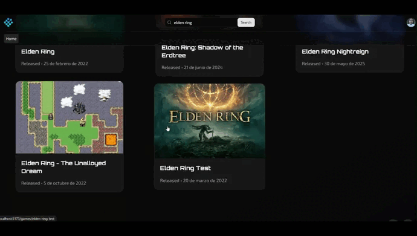

# Pixel Reviews

[](./LICENSE.txt)


**Your definitive portal for video game reviews. A place created by and for gamers.**

Pixel Reviews is a dynamic web platform where video game enthusiasts can discover, analyze, and debate their favorite titles. Forget about sponsored reviews; here, the voice that matters is that of the community.

---

## Visual Demo

Nothing beats seeing it in action!



---

## 📖 Table of Contents

* [Key Features](#-key-features)
* [Technologies Used](#%EF%B8%8F-technologies-used)
* [Getting Started (Installation)](#-getting-started)
* [Usage](#-usage)
* [How to Contribute](#-how-to-contribute)
* [License](#-license)
* [Contact](#-contact)

---

## 🌟 Key Features

* **🎮 Account Management:** Profile creation, login, and profile editing.
* **✍️ Review and Rating System:** Users can write detailed reviews and assign ratings on a 1 to 5 star scale.
* **🧑‍🤝‍🧑 User Profiles:** Each user has a public profile displaying their recent activity, reviews, and favorite games.
* **🔍 Advanced Search:** A powerful search engine to find games by title.
* **ℹ️ Detailed Game Pages:** Each game has its own page with a synopsis, metadata (developer, release date), and a listing of community reviews.
* **❤️ Personal Lists:** Functionality to create lists for "Library Games" and "Wishlist."
* **📊 Score Aggregation:** Calculation of the community's average score for each game.

---

## 🛠️ Technologies Used

This project was built using a modern and scalable stack:

* **Frontend:** `React, Vite, TailwindCSS`
* **Backend:** `Flask`
* **Database:** `PostgresSQL`
* **Authentication:** `JWT`
* **Game API:** `RAWG.io`

---

## 🚀 Getting Started

Follow these steps to set up a local copy of the project and start contributing.

### Prerequisites

Make sure you have installed:
* `Node.js (v18+ recommended)`
* `Python v3.13+`
* `npm`
* `pip`
* `PostgreSQL`

### Installation

1.  **Clone the repository:**

    ```bash
    git clone https://github.com/Yisusocanto/pixel_reviews.git

    cd pixel-reviews
    ```


2.  **Install Backend dependencies:**

    ```bash
    cd pixel-reviews-backend
    python -m venv venv
   
    # Activate the virtual environment
    # For Windows:
    .\venv\Scripts\activate
    # For macOS/Linux:
    # source venv/bin/activate 
    
    pip install -r requirements.txt
    ```


3.  **Install Frontend dependencies:**
    ```bash
    cd pixel-reviews-frontend
    npm install
    ```


4.  **Configura las variables de entorno:**


    Create a file named `.env` in the `backend` folder:

    

    ```env
    # Database

    DB_HOST=[your-host]

    DB_USER=[your-user]

    DB_PASS=[your-password]

    DB_NAME=[name-db]


    # Authentication

    SECRECT_KEY_JWT=[your-secret]

    # Frontend URL
    FRONTEND_URL=["http://localhost:5173", "http://127.0.0.1:5173"]


    # External API

    API_RAWG_KEY=[your-api-key]

    API_RESEND_KEY=[your-api-key]


    # Cloud

    CLOUDINARY_URL=[your-url]
    ```

5. **Initialize the Database Schema (Alembic):**

   This step assumes you have already created an **empty database** named `pixel_reviews` in your PostgreSQL instance (using a tool like psql or pgAdmin).

   ```bash
   # Apply the existing migrations to create all tables.
   # This command uses Alembic to build the schema from your models.
   alembic upgrade head

6.  **¡Run the project!**

    * Para el Backend: `py app.py`

    * Para el Frontend: `npm run dev`

---

## Usage

Once the server is running:

1. Open your browser and go to `http://localhost:[your-frontend-host]` (e.g. `http://localhost:5173`).
2. Sign up to create a new account and start reviewing!

---

## 🤝 How to Contribute

Contributions are welcome! If you want to improve the project, please follow these steps:

1. Fork the repository.
2. Create a new branch for your feature (`git checkout -b feature/MejoraIncreible`).
3. Commit your changes (`git commit -m 'Adds an Amazing Improvement'`).
4. Push to your branch (`git push origin feature/MejoraIncreible`).
5. Open a Pull Request.

---

## 📜 License

This project is licensed under the MIT License. See the [LICENSE](./LICENSE.txt) file for more details.

---

## 📬 Contact

**Jesus Ocanto**
* **LinkedIn:** `www.linkedin.com/in/jesús-ocanto-447694220`
* **GitHub:** `https://github.com/Yisusocanto`
* **Email:** `yisusocanto1984@gmail.com`

Made with ❤️ by the gaming community.